# 🎲 Parchis Game - Monorepo

> [!CAUTION]  
> **✨ 100% Vibecoded ✨**  
> This application was built entirely through vibecoding.   
> 
> *I originally wanted to build a game to play with my family, and over time I kept adding improvements. Although I have exposed the game online a few times to play with remote family, **I do not recommend doing so**. Due to the nature of the code, it could contain many security vulnerabilities. Play locally or at your own risk!*

Welcome to the Parchis game! This is a complete multiplayer game project including a server (Node.js/Express) and a web client (Vite/TypeScript).

➤ **[📖 Read the Official Game Guide here!](docs/wiki/Home.md)** For complete game rules, server configuration guides, and moderation tools.

## 📸 Screenshots

<details>
  <summary>Click here to view screenshots</summary>

  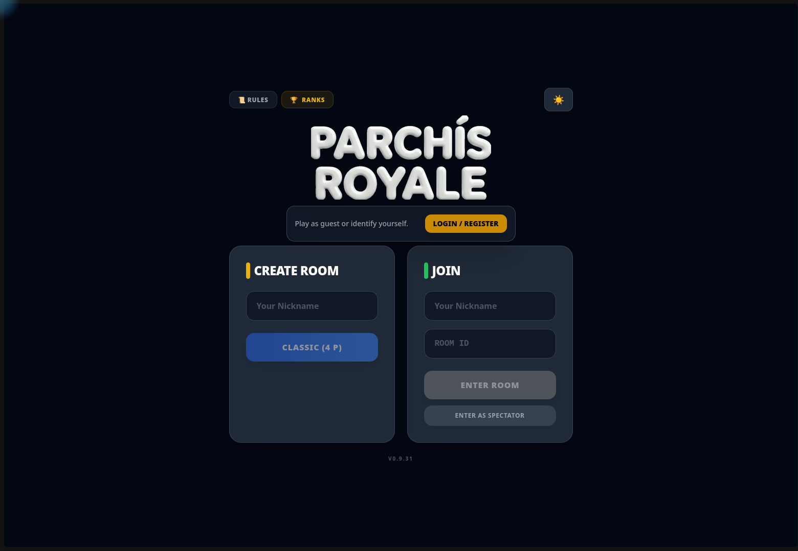
  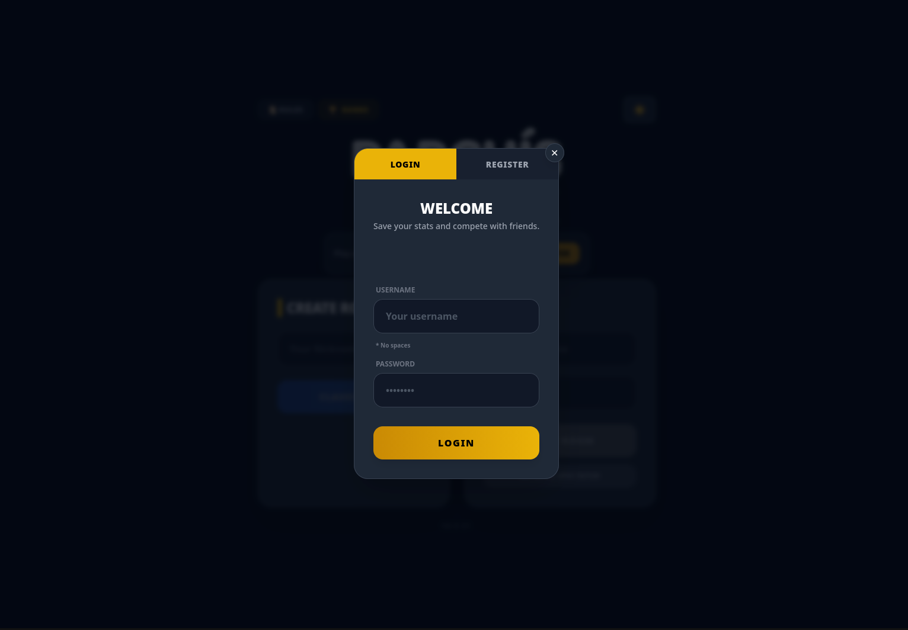
  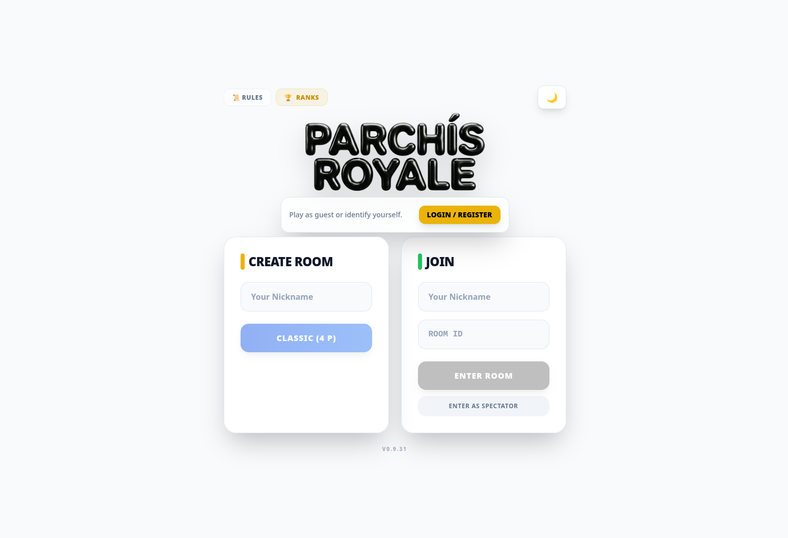
  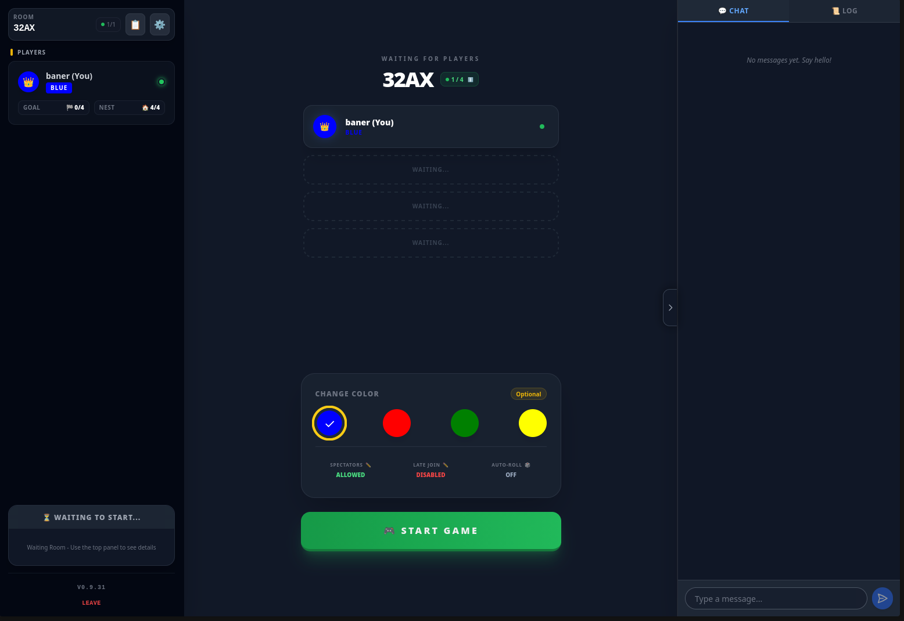
  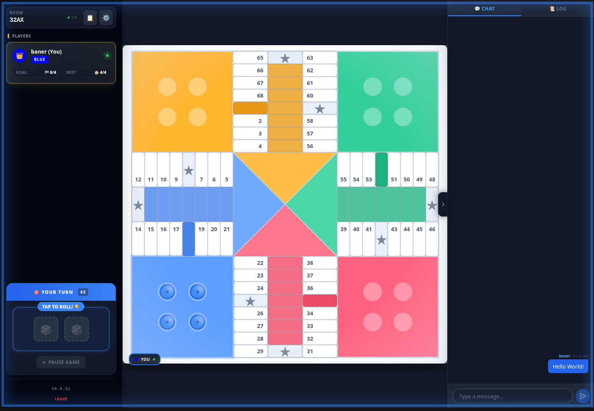
  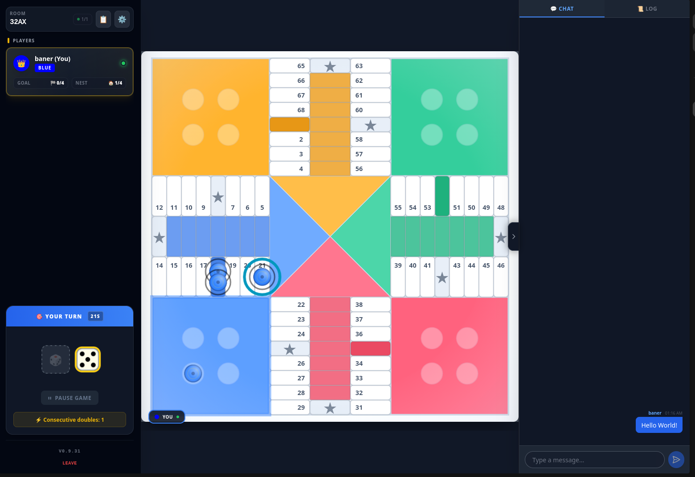
  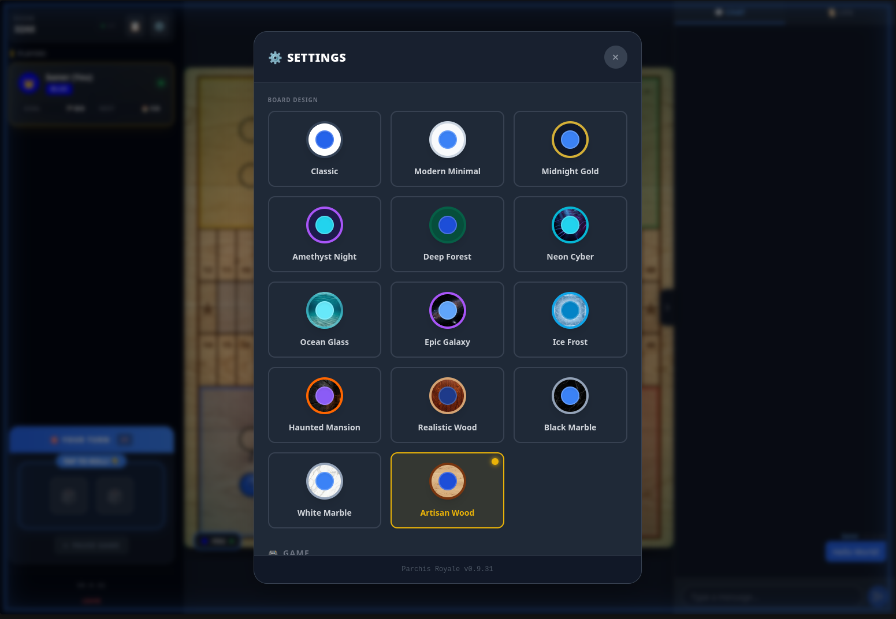
  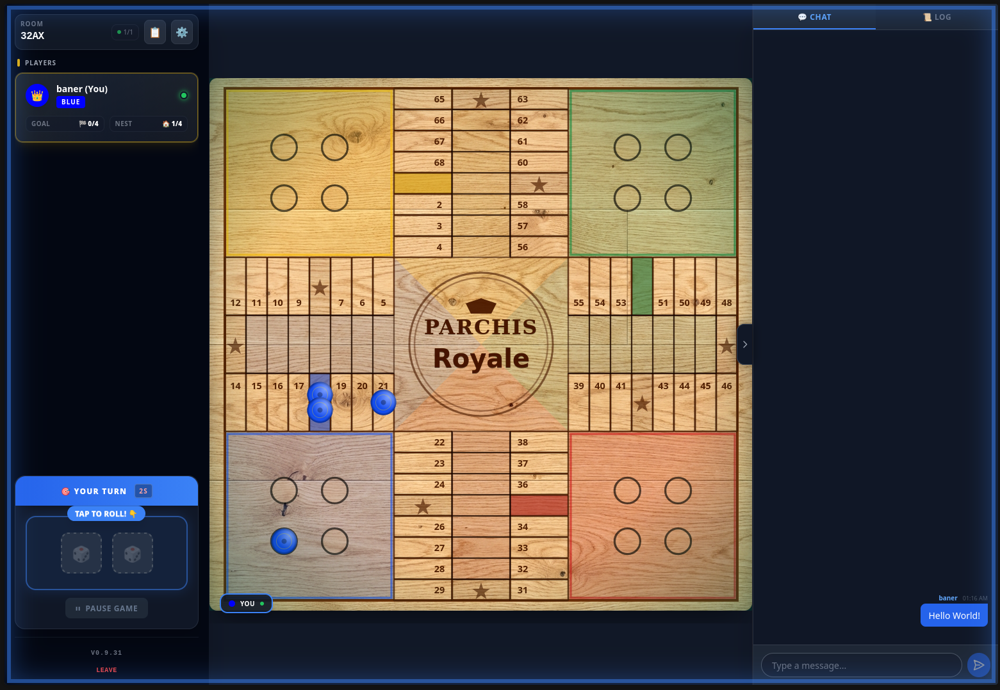
  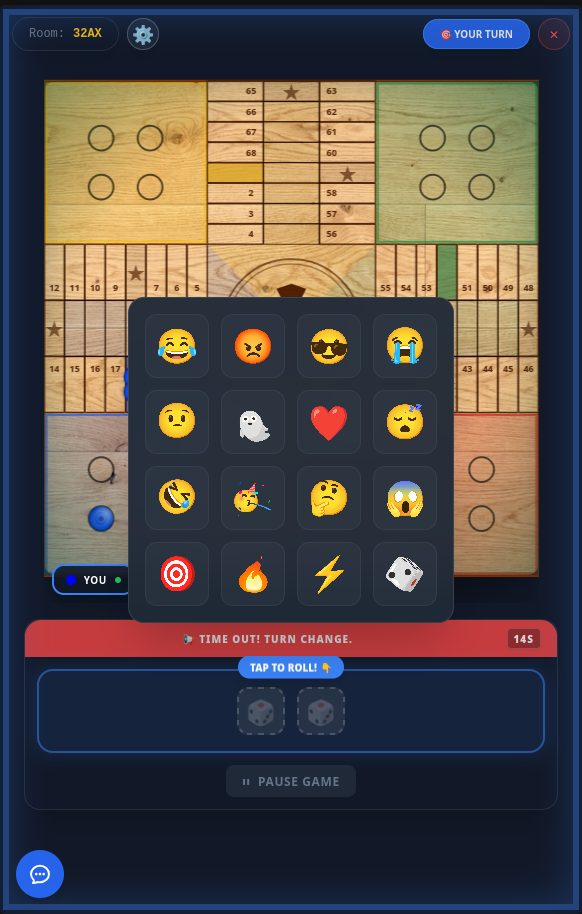
  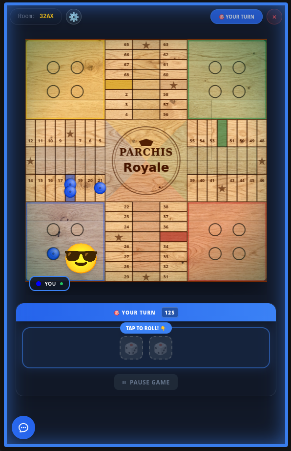
  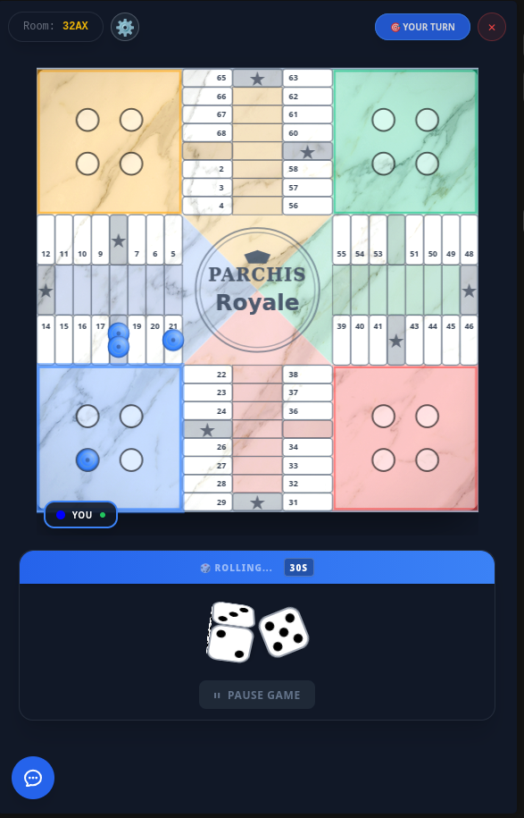
  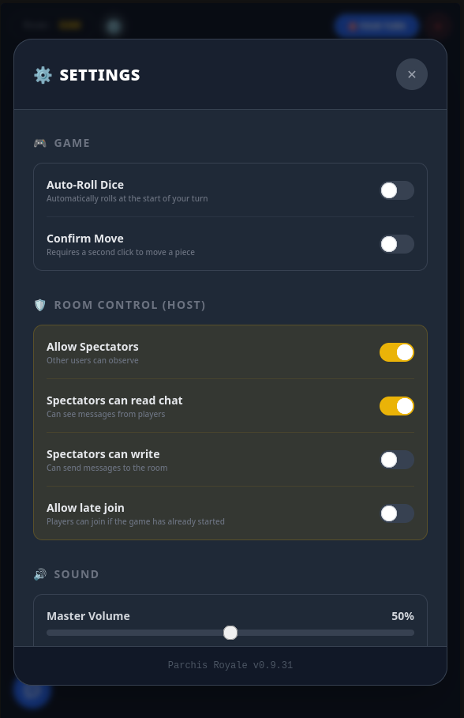

</details>

## ✨ Features

<details>
  <summary>Click here to view the full feature list</summary>

### 🎲 Gameplay
*   **Multiplayer Matches:** Real-time 4-player game modes.
*   **Pause Game:** The room host can momentarily stop the game timer and action for breaks.
*   **Visual Themes:** Select different board themes and color aesthetics to customize the game board.
*   **Real-time Synchronization:** Powered by Socket.io, the game state (dice, piece movements, captures) updates instantly across all connected clients.
*   **Spectator Mode:** Users can dynamically join full or in-progress games just to watch without interfering.
*   **Strict Rules Enforcement:** Server-side validation guarantees legal moves only (e.g. rolling a 5 to exit home, exact moves to the goal, barrier mechanics).
*   **Time Bonuses:** Players earn extra turn time by capturing an opponent's piece or moving a piece to the final goal.
*   **AFK Protection:** If a player disconnects or runs out of time on their turn, the server will auto-roll/auto-move (if valid options exist) or skip their turn.
*   **Restart Voting System:** During an active match, players can initiate a democratic vote to start over (Room Creators can force a restart directly).

### 👤 Users & Social
*   **Guests vs Registered:** Jump in quickly with a temporary Guest ID, or create an account to save your long-term progress.
*   **Experience & Leveling (XP):** Registered users level up based on their performance (wins, captured pieces).
*   **Global Leaderboards:** Competitive ranking displaying the top players across the server.
*   **Detailed Analytics:** User profiles track detailed statistics such as games played/won, and even dice probability metrics (total doubles, rolled ones).
*   **In-Game Emotes:** React during live gameplay with animated visual emotes.

### 🛡️ Admin & Moderation Panel
*   **Admin Role:** The very first user to register an account on the server automatically becomes the "Admin".
*   **Live Dashboard:** View real-time metrics, active rooms, and connected players.
*   **User Management:** Change roles, edit usernames, reset passwords, or permanently delete accounts and statistics.
*   **Global Settings:** Modify global turn timers and time bonuses on the fly without restarting the server.
*   **Moderation Power:** Kick players out of rooms, forcefully close active rooms, or ban malicious users (triggering instant socket disconnection).

### ⚙️ Technical / Hosting
*   **Docker Ready:** Pre-configured `docker-compose.yml` for rapid, consistent deployments.
*   **Local Storage (SQLite):** Uses `better-sqlite3` for fast, zero-configuration data persistence—perfect for self-hosting.
*   **Rate Limiting:** Built-in network protection against event spamming (dice or movement flooding) to ensure server stability.

</details>

## 🚀 Project Structure

This repository uses **npm workspaces** to manage the different modules:

- `client/`: Interactive web frontend.
- `server/`: Game server and API.
- `shared/`: Game logic and shared types.

## 🛠️ Technologies

- **Frontend:** React, Vite, Tailwind CSS, TypeScript.
- **Backend:** Node.js, Express, Socket.io, SQLite (better-sqlite3).
- **Deployment:** Docker, Docker Compose.

## 🐳 Deployment with Docker

### Option 1: Quick Start (Recommended)
The easiest way to run the project in production is using Docker with our pre-built image from Codeberg Packages. You don't need the source code, just the `docker-compose.yml` file:

```bash
# Download the production composed file
wget https://codeberg.org/baner/parchis/raw/branch/main/docker-compose.yml
```

> [!IMPORTANT]
> **Security Configuration**: Before starting the game, you need to configure a secret key for player authentication. 
> 
> Open the downloaded `docker-compose.yml` file and change the value of `JWT_SECRET` in the `environment` section to a secure random string.
> 
> You can generate a random secure string running this command in your terminal:
> ```bash
> openssl rand -base64 32
> ```

```bash
# Start the game
docker compose up -d
```

### Option 2: Build from Source
If you are developing or want to build the image yourself from the source code, you first need to clone the repository and set up the environment variables:

```bash
# 1. Clone the repository
git clone https://codeberg.org/baner/parchis.git
cd parchis

# 2. Configure environment variables (Docker will handle Node.js, so you don't need it installed)
cp server/.env.example server/.env
cp client/.env.example client/.env

# 3. Edit server/.env and add or modify the JWT_SECRET to a secure string 
#    (you can generate one with: openssl rand -base64 32)

# 4. Build and start the containers
docker compose -f docker-compose-build.yml build --no-cache
docker compose -f docker-compose-build.yml up -d
```

> **Note**: The game will be available at `http://localhost:3000` if you are running it on your own computer. If you are deploying it on a remote server or a Raspberry Pi, replace `localhost` with your server's local IP address (e.g., `http://192.168.1.100:3000`).

## 📦 Local Installation

### Requirements
- Node.js 18+ (Node 22 is recommended)
- npm 9+

If you are on Ubuntu/Debian and don't have Node.js installed, or have an older version from the default repositories, you can install the latest stable version (e.g., Node 22) via NodeSource:

```bash
# Clean up old Node.js versions
sudo apt-get remove -y nodejs npm

# Add the NodeSource repository for Node.js 22.x
curl -fsSL https://deb.nodesource.com/setup_22.x -o nodesource_setup.sh
sudo -E bash nodesource_setup.sh

# Install Node.js and npm
sudo apt-get install -y nodejs
```

### Steps
1. Clone the repository:
   ```bash
   git clone https://codeberg.org/baner/parchis.git
   cd parchis
   ```

2. Install dependencies:
   ```bash
   npm install
   ```

3. Configure environment variables:
   - Copy the example templates:
     ```bash
     cp server/.env.example server/.env
     cp client/.env.example client/.env
     ```
   - Edit the `.env` files with your values.

4. Run in development mode:
   - **Server:** `npm run dev:server`
   - **Client:** `npm run dev:client`

## ⚙️ Manual Production Deployment (Without Docker)

If you prefer to run the application directly on your server without Docker, follow these steps:

### 0. Prerequisites (Ubuntu/Debian)
Default Linux repositories often ship with outdated versions of Node.js. Parchis requires Node 18 or higher. To install the latest version via NodeSource:

```bash
# Clean up old Node.js versions
sudo apt-get remove -y nodejs npm

# Add the NodeSource repository for Node.js 22.x
curl -fsSL https://deb.nodesource.com/setup_22.x -o nodesource_setup.sh
sudo -E bash nodesource_setup.sh

# Install Node.js and npm
sudo apt-get install -y nodejs

# Verify the versions (should be Node 22+ and npm 10+)
node -v
npm -v
```

### 1. Build the applications

Compile both the server (TypeScript to JS) and the client (Vite build):

```bash
npm run build:server
npm run build:client
```

### 2. Run with npm

You can start the compiled server which will also serve the statically built client files:

```bash
npm run start
```

### 3. Running as a Systemd Service (Recommended for Linux)

To ensure the game runs in the background and restarts automatically if it crashes or if the server reboots, you can create a systemd service.

Create a new file at `/etc/systemd/system/parchis.service`:

```ini
[Unit]
Description=Parchis Game Server
After=network.target

[Service]
Type=simple
User=your_username
WorkingDirectory=/absolute/path/to/your/parchis
ExecStart=/usr/bin/npm run start
Environment="NODE_ENV=production"
# Add other environment variables here if you didn't define them in a .env file
# Environment="PORT=3000"
Restart=on-failure
RestartSec=10

[Install]
WantedBy=multi-user.target
```

*Note: Replace `your_username` with your actual Linux username and `/absolute/path/to/your/parchis` with the full path to your cloned repository.*

**Enable and start the service:**

```bash
# Reload systemd to recognize the new service
sudo systemctl daemon-reload

# Enable it to start on boot
sudo systemctl enable parchis

# Start the service right now
sudo systemctl start parchis

# Check its status
sudo systemctl status parchis
```

## 📜 License & Disclaimer

This project is licensed under the **GNU Affero General Public License Version 3 (AGPL-3.0)**. See the [LICENSE](LICENSE) file for details.

> [!WARNING]
> **Disclaimer:** This software is provided "as is", without warranty of any kind. You use this software at your own risk. The developers assume no liability for data loss, service interruptions, or any other issues arising from its use or deployment.


